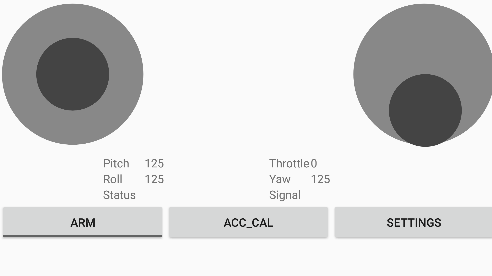
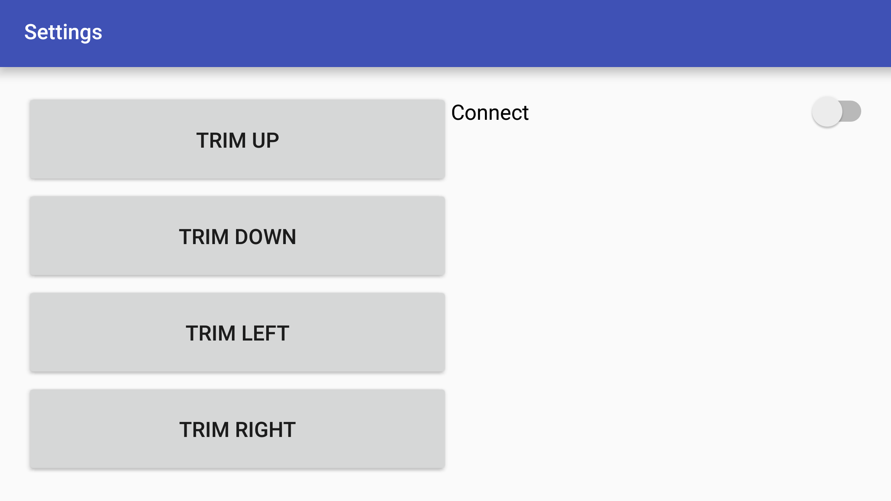

MultiWii 2.2 based quadcopter controller
========================================

This is a very simple quadcopter controller following the MultiWii Serial Protocol(MSP) format. The control signals are sent via UDP while the android phone is connected to the ESP-01 module(Wifi AP) of the quadcopter. The message IDs are customized, so it will not work for standard MWC(MultiWii Copter) quadcopters. For more information on MultiWii Serial Protocol(MSP), see [this](http://www.multiwii.com/wiki/index.php?title=Multiwii_Serial_Protocol).

Currently there is only the uplink communication to the MWC, therefore the application is unable to obtain the quadcopter's status.

The joystick UI is from mobile-anarchy-widgets and I am using MultiWii 2.2 for my custom MultiWii quadcopter. Joystick UI license: New BSD License, holder/author: mobile-anarchy-widgets (admin /at/ mobileanarchy.com). MultiWii 2.2 License: GNU GPL v3. I do not claim ownership for these 2 projects.

The joystick UI can be found [here](https://code.google.com/p/mobile-anarchy-widgets/wiki/JoystickView "mobile-anarchy-widgets").

Check out the [MultiWii website](http://www.multiwii.com/software) for other versions of MultiWii.

I wrote this application to study MWC quadcopters' interface in my free time.

### Build Information
 - IDE : Android Studio
 - SDK : Android SDK 23 (Consult build.gradle script for more information)
 
### Screenshots

#### Main UI

#### Settings UI

